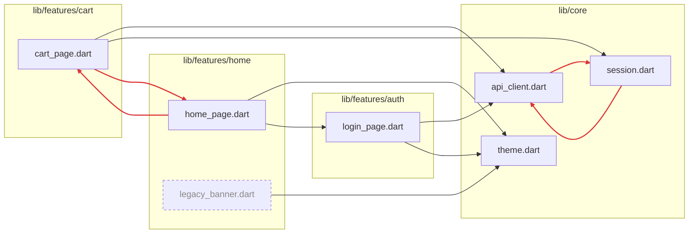

```txt

████████╗██╗██████╗░██╗░░░██╗  ██╗███╗░░░███╗██████╗░░█████╗░██████╗░████████╗░██████╗
╚══██╔══╝██║██╔══██╗╚██╗░██╔╝  ██║████╗░████║██╔══██╗██╔══██╗██╔══██╗╚══██╔══╝██╔════╝
░░░██║░░░██║██║░░██║░╚████╔╝░  ██║██╔████╔██║██████╔╝██║░░██║██████╔╝░░░██║░░░╚█████╗░
░░░██║░░░██║██║░░██║░░╚██╔╝░░  ██║██║╚██╔╝██║██╔═══╝░██║░░██║██╔══██╗░░░██║░░░░╚═══██╗
░░░██║░░░██║██████╔╝░░░██║░░░  ██║██║░╚═╝░██║██║░░░░░╚█████╔╝██║░░██║░░░██║░░░██████╔╝
░░░╚═╝░░░╚═╝╚═════╝░░░░╚═╝░░░  ╚═╝╚═╝░░░░░╚═╝╚═╝░░░░░░╚════╝░╚═╝░░╚═╝░░░╚═╝░░░╚═════╝░
```

[](https://pub.dev/packages/tidy_imports)
[](https://pub.dev/packages/tidy_imports/score)
[](https://pub.dev/packages/tidy_imports/score)
[](https://dart.dev)
[](https://github.com/Franklyn-R-Silva/tidy_imports/actions/workflows/test.yml)
[](LICENSE)

A Dart CLI tool that automatically organizes your import statements — sorted
alphabetically and grouped by origin (Dart, Flutter, package, project).

Spiritual successor to [import_sorter](https://github.com/fluttercommunity/import_sorter),
rebuilt for Dart 3+ with bug fixes, new flags, custom import tiers, `pubspec.yaml`
sorting, and monorepo support.

<p align="center">
  
</p>

<p align="center">
  <a href="#quick-start">Quick start</a> ·
  <a href="#agree-with-your-lints">Lints</a> ·
  <a href="#see-your-architecture">Import graph</a> ·
  <a href="#ci">CI</a> ·
  <a href="https://github.com/Franklyn-R-Silva/tidy_imports/tree/main/docs">Documentation</a> ·
  <a href="https://github.com/Franklyn-R-Silva/tidy_imports/blob/main/CHANGELOG.md">Changelog</a>
</p>

## Features

- **Sorted and grouped, the same way on every machine** — Dart, Flutter,
  packages, your own project, each under a label. One command;
  `--exit-if-changed` holds the line in CI.
- **Agrees with your toolchain instead of fighting it** — writes the blank line
  `dart format` 3.13+ writes, and [`--doctor`](#agree-with-your-lints) reads your
  `analysis_options.yaml` to tell you which options your lints need.
- **Every lint's shape** — `--flat` for `directives_ordering`,
  `--relative-imports` for `prefer_relative_imports`, `--package-imports` for
  `always_use_package_imports`.
- **A picture of your architecture** — [`--report`](#see-your-architecture)
  finds import cycles, dead files and coupling between features, and draws it
  all as Mermaid, DOT or JSON.
- **Your `pubspec.yaml`, checked against your imports** — dependencies nothing
  imports, and dev dependencies your `lib/` quietly ships.
- **Safe on real files** — wrapped `show` clauses, conditional imports,
  `// ignore:` pragmas, trailing comments, imports inside strings or `/* */`:
  every shape that broke a line-based sorter has a test here.
- **Nothing destructive by default** — removing duplicates or unused imports,
  sorting exports or `pubspec.yaml`: all opt-in, all reported.

## Quick start

```sh
dart pub add dev:tidy_imports      # or: flutter pub add dev:tidy_imports
dart run tidy_imports
```

It belongs in `dev_dependencies` — a tool you run over your source, never one
your app imports:

```yaml
dev_dependencies:
  tidy_imports: ^2.6.0
```

### Before

```dart
import 'package:provider/provider.dart';
import 'widgets/user_card.dart';
import 'dart:async';
import 'package:flutter/material.dart';
import 'package:my_app/services/api_client.dart';
import 'package:intl/intl.dart';
import 'dart:convert';
import 'package:http/http.dart' as http;
import 'models/user.dart';
```

### After

```dart
// Dart imports:
import 'dart:async';
import 'dart:convert';

// Flutter imports:
import 'package:flutter/material.dart';

// Package imports:
import 'package:http/http.dart' as http;
import 'package:intl/intl.dart';
import 'package:provider/provider.dart';

// Project imports:
import 'package:my_app/services/api_client.dart';

import 'models/user.dart';
import 'widgets/user_card.dart';
```

Only the directives move. Nothing below them is touched, and nothing is deleted
unless you ask.

## Why tidy_imports?

Nothing in Dart decides what order the imports go in, so they end up in the
order they were typed — an order that gets re-argued in every review, and that
turns two people adding an import to the same file into a merge conflict.
`tidy_imports` picks the rule and applies it identically everywhere, so the list
stops being anybody's decision.

It fills the one gap the Dart toolchain leaves:

| | What ships with Dart | What `tidy_imports` adds |
|---|---|---|
| `dart format` | Whitespace; since 3.13 a blank line between import sections — but it never *reorders* a directive | Orders them, and writes the same blank lines the formatter does |
| Lints | *Report* `directives_ordering`, `prefer_relative_imports`, `always_use_package_imports` | *Fix* them — and `--doctor` says which ones you have on |
| `dart fix` | Removes an unused import | Runs it under `--remove-unused`, then tidies the gap in the same pass |
| — | Nothing groups, labels, or looks at the graph | Group labels, custom tiers, cycles, dead files, coupling, a dependency audit |

## Usage

```sh
dart run tidy_imports                      # sort every Dart file in the project
dart run tidy_imports "lib/features/"      # only what matches a regex
dart run tidy_imports --dry-run            # say what would change, write nothing
dart run tidy_imports --exit-if-changed    # CI: fail if anything is unsorted
dart run tidy_imports --doctor             # which options your lints want
dart run tidy_imports --report             # what the imports say about the project
```

Run it from the folder that holds `pubspec.yaml`. Positional arguments are
regular expressions matched against the path, written with forward slashes on
every platform.
→ [Getting started](https://github.com/Franklyn-R-Silva/tidy_imports/blob/main/docs/getting-started.md)

## Agree with your lints

Three lints read your imports too, and a sorter that writes what a lint reports
makes the two tools undo each other forever. `--doctor` reads
`analysis_options.yaml` — following its `include:` chain — and says what your
configuration needs:

```
$ dart run tidy_imports --doctor
┏━━ Checking the tidy_imports configuration against analysis_options.yaml
┃  Lints that read imports: directives_ordering, always_use_package_imports
┃  ✖ `directives_ordering` (from analysis_options.yaml) wants one
┃    alphabetical run per section, and the grouped output breaks it […]
┃      → flat: true, sort_exports: true
┃  ! `always_use_package_imports` (from analysis_options.yaml) is on.
┃    `package_imports` rewrites the relative imports under lib/ into the
┃    `package:` form it asks for.
┃      → package_imports: true, relative_imports: false
┗━━ ✖ 1 fight, 1 suggestion
```

`--doctor --apply` writes those keys into your config — keeping its comments and
line endings — and `--doctor --exit-if-changed` fails CI while a fight is left
standing. It also flags two lints that contradict each other.

| Lint | Option |
|---|---|
| `directives_ordering` | `--flat --sort-exports` |
| `prefer_relative_imports` | `--relative-imports` |
| `always_use_package_imports` | `--package-imports` |

→ [Agreeing with your lints](https://github.com/Franklyn-R-Silva/tidy_imports/blob/main/docs/lint-agreement.md)

## See your architecture

The directives `tidy_imports` reads on every run *are* your dependency graph.
`--report` says what it shows — and writes nothing:

```
$ dart run tidy_imports --report --feature-depth=2
┏━━ Reading the import graph of 9 files
┃  ✖ 2 groups of files that import each other:
┃     lib/core/api_client.dart → lib/core/session.dart → lib/core/api_client.dart
┃     lib/features/cart/cart_page.dart → lib/features/home/home_page.dart → lib/features/cart/cart_page.dart
┃  ! 1 file no entry point reaches:
┃     lib/features/home/legacy_banner.dart
┃  ! 1 dependency in pubspec.yaml nothing imports:
┃     intl
┃  ✖ 1 package imported under lib/, bin/ or hook/ but declared only in dev_dependencies:
┃     mocktail — lib/features/home/home_page.dart
┃  Most imported:
┃     4  lib/core/theme.dart
┃  Features at feature_depth 2 — files, imports in and out, instability:
┃     lib/core              3 files  in   7  out   0  I 0.00
┃     lib/features/cart     1 files  in   1  out   3  I 0.75
┗━━ • 5 findings
```

`--format=mermaid` turns the same graph into a diagram GitHub draws in a README
or a pull request — features boxed, cycles in red, dead files dashed:



`--format=dot` feeds Graphviz, and `--format=json` feeds your own tooling.
`--report --exit-if-changed` fails CI on any finding.
→ [The import graph](https://github.com/Franklyn-R-Silva/tidy_imports/blob/main/docs/import-graph.md)

## Configuration

Every option is a flag and a key in a `tidy_imports:` block of `pubspec.yaml`
(or a standalone `tidy_imports.yaml`). A flag you type wins over the file, in
either direction — every one is negatable.

```yaml
tidy_imports:
  flat: true
  sort_exports: true
  package_imports: true
  ignored_files:
    - \.g\.dart$
  tiers:
    - name: "Company imports:"
      pattern: "package:acme_"
```

A misspelled option, a value of the wrong type or a file that does not parse is
a warning naming the key — never silence — and `--strict-config` makes it fatal.

### Options

| Flag | What it does |
|---|---|
| `--flat` | One alphabetical run per section, for `directives_ordering` |
| `--relative-imports` | Own imports under `lib/` as relative paths, for `prefer_relative_imports` |
| `--package-imports` | Relative imports under `lib/` as `package:`, for `always_use_package_imports` |
| `--sort-exports` | `export` directives in a block of their own |
| `--group-by-folder`, `--group-by-folder-depth=<n>` | Break the Project group by folder |
| `--test-imports` | `fake_*` / `mock_*` files in a group of their own |
| `--attach-comments` | A note above an import moves with it |
| `--remove-duplicates` | Drop an import written twice |
| `--remove-unused` | Run `dart fix --code=unused_import` first |
| `--sort-pubspec` | Sort the dependency sections of `pubspec.yaml` |
| `-e`, `--emojis` · `--no-comments` · `--no-blank-lines` | Shape the labels and spacing |
| `--no-separate-relative-imports` | Drop the blank line `dart format` 3.13+ writes (on by default) |
| `--doctor` · `--apply` | Check the config against your lints · write the fixes |
| `--report` · `--format` · `--feature-depth` | Read the import graph · as text, Mermaid, DOT or JSON · feature size |
| `--dry-run` · `--exit-if-changed` | Write nothing · fail when something would change |
| `--ignore-config` · `--strict-config` | Skip the config · fail on a config problem |

→ [Every flag and config key](https://github.com/Franklyn-R-Silva/tidy_imports/blob/main/docs/configuration.md)

## CI

```yaml
# .github/workflows/ci.yml
- run: dart run tidy_imports --exit-if-changed           # imports are sorted
- run: dart run tidy_imports --doctor --exit-if-changed  # config agrees with the lints
- run: dart run tidy_imports --report --exit-if-changed  # no cycles, dead files, dev-only imports
```

Every check reads the whole project and names **every** problem before exiting
`1`, so one run shows everything to fix. Every user error is one line on stderr,
never a stack trace.

```yaml
# .pre-commit-config.yaml
repos:
  - repo: https://github.com/Franklyn-R-Silva/tidy_imports
    rev: 'v2.6.0'
    hooks:
      - id: dart-import-sorter      # or flutter-import-sorter
```

→ [CI, exit codes, and the import graph in your job summary](https://github.com/Franklyn-R-Silva/tidy_imports/blob/main/docs/ci.md)

## Documentation

| | |
|---|---|
| [Getting started](https://github.com/Franklyn-R-Silva/tidy_imports/blob/main/docs/getting-started.md) | Installing, running, choosing files, what is on by default |
| [Configuration](https://github.com/Franklyn-R-Silva/tidy_imports/blob/main/docs/configuration.md) | Every flag and config key, the standalone file, diagnostics |
| [Shaping the output](https://github.com/Franklyn-R-Silva/tidy_imports/blob/main/docs/output-shape.md) | Groups, custom tiers, exports, folders, test doubles |
| [Agreeing with your lints](https://github.com/Franklyn-R-Silva/tidy_imports/blob/main/docs/lint-agreement.md) | `--doctor`, `--flat`, relative and package imports, `dart format` |
| [Cleaning up](https://github.com/Franklyn-R-Silva/tidy_imports/blob/main/docs/cleanup.md) | Duplicates, unused imports, `pubspec.yaml` |
| [The import graph](https://github.com/Franklyn-R-Silva/tidy_imports/blob/main/docs/import-graph.md) | Cycles, dead files, dependencies, coupling, Mermaid / DOT / JSON |
| [Tricky imports](https://github.com/Franklyn-R-Silva/tidy_imports/blob/main/docs/tricky-imports.md) | Multi-line, conditional and commented directives |
| [CI](https://github.com/Franklyn-R-Silva/tidy_imports/blob/main/docs/ci.md) | GitHub Actions, exit codes, pre-commit |
| [Using it as a library](https://github.com/Franklyn-R-Silva/tidy_imports/blob/main/docs/library-api.md) | The pure functions behind the CLI |

## Coming from import_sorter

The default output is the same — same groups, same labels, same order — so
switching is a dependency swap and a renamed config block.
→ [What changed, and how to switch](https://github.com/Franklyn-R-Silva/tidy_imports/blob/main/docs/migrating-from-import_sorter.md)

## Contributing

Pull requests are welcome — see [CONTRIBUTING.md](CONTRIBUTING.md) for the dev
setup, the commit format and the release process.
[Code of Conduct](CODE_OF_CONDUCT.md) · [Security Policy](SECURITY.md) ·
[Changelog](CHANGELOG.md)

## Credits

Built on the original work by [@gleich](https://github.com/gleich) and the
contributors of [import_sorter](https://github.com/fluttercommunity/import_sorter).

## License

[MIT](LICENSE) © Franklyn R. Silva
