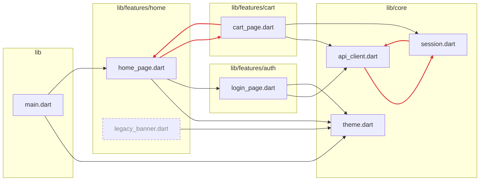

# The import graph

`tidy_imports` already parses every directive in your project on every run.
Those directives *are* a dependency graph — `--report` says what it shows. It
sorts nothing and writes nothing.

```sh
dart run tidy_imports --report
```

```
┏━━ Reading the import graph of 9 files
┃  ✖ 2 groups of files that import each other:
┃     lib/core/api_client.dart → lib/core/session.dart → lib/core/api_client.dart
┃     lib/features/cart/cart_page.dart → lib/features/home/home_page.dart → lib/features/cart/cart_page.dart
┃  ! 1 file no entry point reaches:
┃     lib/features/home/legacy_banner.dart
┃     (build_runner, reflection and dynamic loading are invisible here — read before deleting)
┃  ! 1 dependency in pubspec.yaml nothing imports:
┃     intl
┃  ✖ 1 package imported under lib/, bin/ or hook/ but declared only in dev_dependencies:
┃     mocktail — lib/features/home/home_page.dart
┃  Most imported:
┃     4  lib/core/theme.dart
┃     3  lib/core/api_client.dart
┃  Imports the most:
┃     3  lib/features/cart/cart_page.dart
┃     3  lib/features/home/home_page.dart
┃  Features at feature_depth 2 — files, imports in and out, instability:
┃     lib                   1 files  in   0  out   2  I 1.00
┃     lib/core              3 files  in   7  out   0  I 0.00
┃     lib/features/auth     1 files  in   1  out   2  I 0.67
┃     lib/features/cart     1 files  in   1  out   3  I 0.75
┃     lib/features/home     2 files  in   2  out   4  I 0.67
┃  Strongest coupling:
┃     lib/features/auth → lib/core  (2 imports)
┃     lib/features/cart → lib/core  (2 imports)
┗━━ • 5 findings
```

The first four sections are **findings**; the rest is information.

## Findings

**Files that import each other.** Dart allows import cycles, so nothing in the
toolchain points them out — but two files in a cycle cannot be read, tested or
moved apart independently. Each group is drawn as a walk along imports that
really exist; when the group is larger than the shortest loop through it, the
rest is counted (`+2 more in this group`).

**Files no entry point reaches.** Not an unused *import* — a whole file that no
entry point can get to through any chain of `import`, `export` or `part`. That
sees through a dead barrel to the files it exports, and through a pair of dead
files that only import each other.

### Checking imports against `pubspec.yaml`

**A dependency nothing imports.** Declared under `dependencies:` and named by
no `import`, `export` or `part` anywhere in the package — tests included, so a
package used only by the tests is not reported here. SDK entries
(`flutter: {sdk: flutter}`) and `cupertino_icons` are never reported.

**A dev dependency shipped from `lib/`, `bin/` or `hook/`.** It builds in your own
package, where dev dependencies resolve — which is exactly what makes it easy
to miss. Pub never resolves a package's dev dependencies for the packages that
depend on it, so nobody who depends on yours can build it. Move it to
`dependencies`.

Build hooks under `hook/` run for every package that depends on yours, so they
count as shipped code too. With `flutter: generate: true`, `intl` is never
reported unused: `flutter gen-l10n` writes the code that imports it under
`.dart_tool/`, where no scan of the project sees it.

A font, a code generator or a platform plugin is used without a Dart import, so
the check cannot see it being used. Keep those out with:

```yaml
tidy_imports:
  ignored_dependencies:
    - flutter_native_splash
```

A directory with a pubspec of its own — a sub-package under `packages/`, an
`example/` app — answers to that pubspec, not this one. A package imported but
declared nowhere is left to the analyzer's `depend_on_referenced_packages`,
which already reports it with a fix.

### What counts as an entry point

Anything you can run or publish, so it is unreferenced by definition:

- `lib/main.dart`, and every `lib/main_*.dart` flavour
- any file under `lib/` that declares a top-level `main()`
- every file outside `lib/` — tests, `bin/`, `tool/`, `example/`, `web/`,
  `benchmark/`, `hook/`
- for a **library** — no `publish_to: none`, no `lib/main.dart` — every file
  outside `lib/src/`: pub convention makes that the public surface consumers
  import
- `lib/<your_package>.dart`, the Flutter plugin registrant, and whatever you
  list under `report_roots`:

```yaml
tidy_imports:
  report_roots:
    - /lib/app/bootstrap\.dart   # regex on the project-relative path
```

A generated `.g.dart` is reached through the `part` directive of its owner, so
it is only ever listed alongside a dead owner.

## Metrics

**Most imported** and **imports the most** are fan-in and fan-out: how many
project files depend on a file, and how many it depends on. The first list is
where a change ripples furthest; the second is where a file knows too much.

### Coupling between features

A **feature** is a folder under `lib/`, cut to `feature_depth` folders —
`lib/src/` is looked through, so `lib/src/auth/` and `lib/auth/` both count as
`auth`. For each feature the report counts the imports reaching in from other
features (Ca) and going out to them (Ce), and its **instability**,
Ce / (Ca + Ce):

- `0.00` — everything leans on it and it leans on nothing: a core. Change it
  with care.
- `1.00` — it leans on others and nothing leans on it: a leaf, free to change.

A core that depends on a feature, or two features that lean on each other, is
the coupling worth a second look. **Strongest coupling** lists the heaviest
pairs.

The common `lib/features/<name>/` layout wants `feature_depth: 2` — at the
default of 1 all of it is one feature called `features`, and the report says so
when a single folder holds most of `lib/`:

```sh
dart run tidy_imports --report --feature-depth=2
```

## Formats

`--format` prints the graph for somewhere other than a terminal. Only the
artifact goes to stdout; warnings go to stderr, so a redirect captures exactly
the file. `--exit-if-changed` keeps its exit code in every format.

| Format | For | Draws |
|---|---|---|
| `text` (default) | You, in a terminal | Findings and metrics |
| `mermaid` | A README, an issue, a pull request — GitHub draws it inline | Files under `lib/`, boxed by feature |
| `dot` | `dot -Tsvg`, for a graph too big for Mermaid | The same drawing, features as clusters |
| `json` | Tooling, dashboards, your own checks | Everything, with a `schemaVersion` |

### Mermaid

```sh
dart run tidy_imports --report --format=mermaid --feature-depth=2
```

Paste the output into a ` ```mermaid ` block and GitHub renders it. Edges inside
an import cycle are red, unreachable files are dashed:



Ids follow path order, so the same graph always prints the same text and a diff
of two reports shows exactly what changed. Mermaid stops drawing past 500
edges — the run warns you on stderr; narrow it with a pattern
(`"lib/features/auth/"`) or switch to DOT.

Tests, tools and examples are left out of the drawing, since they would bury
the architecture — but they still count as importers, so a file only a test
uses is not drawn as dead.

### DOT

```sh
dart run tidy_imports --report --format=dot > imports.dot
dot -Tsvg imports.dot -o imports.svg
```

### JSON

```sh
dart run tidy_imports --report --format=json > imports.json
```

```jsonc
{
  "schemaVersion": 1,
  "package": "shop",
  "featureDepth": 1,
  "files": [
    {
      "path": "lib/core/api_client.dart",
      "library": true,
      "feature": "lib/core",
      "imports": ["lib/core/session.dart"],
      "importedBy": 3,
      "reachable": true,
      "cycle": 0          // index into "cycles", or null
    }
  ],
  "cycles": [["lib/core/api_client.dart", "lib/core/session.dart"]],
  "unreachable": ["lib/features/home/legacy_banner.dart"],
  "metrics": {
    "mostImported":  [{ "path": "lib/core/theme.dart", "count": 4 }],
    "mostImporting": [{ "path": "lib/features/home/home_page.dart", "count": 3 }],
    "features": [{ "name": "lib/core", "files": 3, "afferent": 7, "efferent": 0, "instability": 0.0 }],
    "coupling": [{ "from": "lib/features/auth", "to": "lib/core", "edges": 2 }]
  },
  "dependencies": {
    "unused": ["intl"],
    "devOnly": [{ "package": "mocktail", "files": ["lib/features/home/home_page.dart"] }]
  }
}
```

`schemaVersion` changes only when a field changes meaning or goes away; a new
field is not a new version.

> **Windows PowerShell 5.1** writes `>` redirects as UTF-16. Use
> `| Out-File -Encoding utf8 imports.json`, or PowerShell 7, or Git Bash.

## Narrowing the report

A positional pattern or an `ignored_files` entry narrows what is **printed**,
never what is **read**. The graph is always built from the whole project, so a
file kept alive only by something you filtered out is still alive:

```sh
dart run tidy_imports --report "lib/features/"
```

That is also how a cycle inside generated code gets out of the way without
losing its edges — `flutter gen-l10n` output is the stock example:

```yaml
tidy_imports:
  ignored_files:
    - /lib/l10n/
```

What a pattern narrows, precisely:

| Narrowed to the files in scope | Always the whole package |
|---|---|
| Dead files, dev-only imports, most imported / imports the most, the drawn nodes, JSON `files` | Each cycle that touches the scope, listed whole — a cycle cut down to the files in scope is not a cycle any more |
| | Feature metrics and coupling — a feature's coupling is to everything outside it |
| | Unused dependencies — they belong to the package, not to a file |

## In CI

```sh
dart run tidy_imports --report --exit-if-changed
```

Exits 1 on any finding, with a line on stderr saying why, so a cycle or a
dev-only import introduced by a pull request fails the build instead of
settling in. A run that finds no Dart files at all also exits 1 here: a gate
that inspected nothing must not pass. See [CI](ci.md) for putting the Mermaid
graph in the job summary.

## What it cannot see

The graph is built from directives, nothing else. Code reached by
`build_runner`, reflection, or a path assembled at runtime is invisible to it,
and so is a package used without an import. An "unreachable" file or an "unused"
dependency is a question to answer, not an instruction to follow. Read before
deleting.
